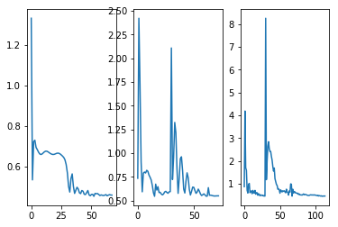
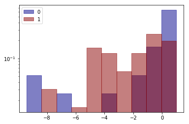
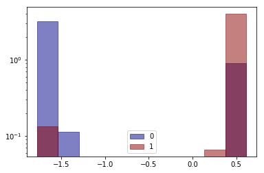
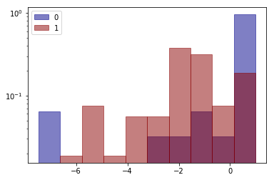
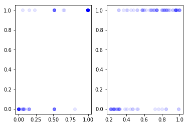
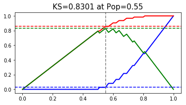
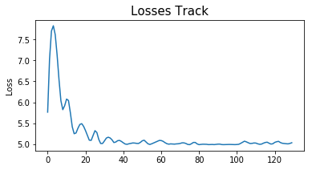

In many financial situations like default prediction, interpretable models are required. Linear models like 
logistic model are often used to reach the requirement. Meanwhile, in order to make the model robust, people
often apply single variable transformation like WOE. However, such transformation has two main drawbacks:

    1) It is sensitive to noise and sometimes yields transformed boxes which are not monotone.
    2) Because of the loss of monotonicity, interpretibility can not be guaranteed.
    
This repository introduce a new method of single variable transformation, which can ensure that the transformation
is monotone as well as continues.

Further more, the repository also presents LinearModel.py which offers a series of modified logistic models. 
The dome jupyter file shows that the modified methods outperforms the state of art logistic model in terms of accuracy 
and robustness.

*MonoLogitTrans.py* : 

    Description:
        The module offers an algorithm of single varaible transformation, which has following propertities:
            1) positively corelated with P(Y=1)
            2) offers paramater to choose if the transformation is guaranteed to be monotone
            3) theoretically equivalent to the logit of P(Y=1) 
        
        How:
            If the parameter method='wide':
                Fit MLP between single varaible and Y. The loss function is made up of two parts,
                cross entropy and loss of monotonicity.
                The difination of loss of monotonicity is:
                    $\text{loss_monotonous}(x,f(x)) = 1 - |(\rho(x,f(x)))|$
                    $\rho(x,y)$ is Pearson correlation coefficient.
                The final loss function is:
                    loss = cross_entropy($\sigma$(f(x)),y)+lambda_monotonous*loss_monotonous(x,f(x))
            If the parameter method='strict':
                The sign of all the weights in the same hiden layer are constrainted to be the same. Hence, the 
                MLP is nested function of monotone functions, which means that the MLP is a monotone function.
                In this situation, the loss function is simply the cross entropu loss.
    Version info：
        sklearn 0.20.1
        tensorflow 1.13.1
        python 3.7.1
        
*LinearModel.py* : 

    Description:
        The module offers a siries of class of logistic regression, which are similar to the logistic regressions offered
        by sklearn when people use them. For example, they have methods like fit(), predict(), predict_proba(), etc.
        The main modifications are:
            1）In order to cooperate with single variable transformations like WOE which are positively correlated with
               P(Y=1), the class PosLassoClassifier and PosLassoClassifierCV offers logistic regression with constraint 
               that all the coefficients are positive.
            2）They adopt SGD with choice of start point of ridge regression estimator or random normal.
            3) To deal with outliers, the loss of each batch can exclude the largest (1-Q0)*100% elements with label
               Y=0 and (1-Q1)*100% elements with label Y=1, before taking the mean, which makes the model nonsensitive
               of cost.
            4) The final estimator can be set to be the mean of estimated values of 100 iterations after converge, 
               in order to get a robust estimation and variable selection, which makes the model nonsensitive to 
               randomness of sampling.
    Version info：
        sklearn 0.20.1
        tensorflow 1.13.1
        matplotlib 3.0.2
        python 3.7.1


```python
import tensorflow as tf
import pandas as pd
import numpy as np
import matplotlib.pyplot as plt
import importlib
import MonoLogitTrans
import LinearModel
import sklearn
from sklearn.linear_model import LogisticRegressionCV
import time
```

**This demo uses breast cancer data offered by sklearn to demonstrate how to use MonoLogitTrans.py to preform single variable transformation, as well as to use LinearModel.py to build binary classifier after that**

The main parts are:

1. Get data
2. Perform single varaible transformation with MonoLogitTrans
3. Modeling and comparision
4. Demonstrate the choice of start point of LinearModel
5. Demonstrate the choice of Q0 and Q1 of LinearModel

### Get Data


```python
importlib.reload(LinearModel)
x1,x2,x3,x1_test,x2_test,x3_test,y,y_test = MonoLogitTrans.get_data()

plt.subplot(1,3,1)
plt.plot(x1,y,'o',alpha=0.1)
plt.subplot(1,3,2)
plt.plot(x2,y,'o',alpha=0.1)
plt.subplot(1,3,3)
plt.plot(x3,y,'o',alpha=0.1)
plt.show()
```


### Perform single varaible transformation with MonoLogitTrans


```python
importlib.reload(MonoLogitTrans)
MonoLogitTrans1 = MonoLogitTrans.MonoLogitTrans(method='strict')
MonoLogitTrans2 = MonoLogitTrans.MonoLogitTrans(method='wide')
MonoLogitTrans3 = MonoLogitTrans.MonoLogitTrans(method='wide',num_hidden=30)
time1 = time.time()
MonoLogitTrans1.fit(x1,y)
MonoLogitTrans2.fit(x2,y)
MonoLogitTrans3.fit(x3,y)
time2 = time.time()
print(time2-time1)

x1_trans = MonoLogitTrans1.transform(x1_test)
x2_trans = MonoLogitTrans2.transform(x2_test)
x3_trans = MonoLogitTrans3.transform(x3_test)
```

    
    WARNING: The TensorFlow contrib module will not be included in TensorFlow 2.0.
    For more information, please see:
      * https://github.com/tensorflow/community/blob/master/rfcs/20180907-contrib-sunset.md
      * https://github.com/tensorflow/addons
    If you depend on functionality not listed there, please file an issue.
    
    WARNING:tensorflow:From C:\Users\BBD\Anaconda3\lib\site-packages\tensorflow\python\framework\op_def_library.py:263: colocate_with (from tensorflow.python.framework.ops) is deprecated and will be removed in a future version.
    Instructions for updating:
    Colocations handled automatically by placer.
    6.544736385345459
    

**Save and load parameters**


```python
#save parameters
MonoLogitTrans1.save_parameter('./Docs/MonoLogitTrans1.txt')
MonoLogitTrans2.save_parameter('./Docs/MonoLogitTrans2.txt')
MonoLogitTrans3.save_parameter('./Docs/MonoLogitTrans3.txt')
#load parameters
MonoLogitTrans1_ = MonoLogitTrans.MonoLogitTrans()
MonoLogitTrans2_ = MonoLogitTrans.MonoLogitTrans()
MonoLogitTrans3_ = MonoLogitTrans.MonoLogitTrans()
MonoLogitTrans1_.load_parameter('./Docs/MonoLogitTrans1.txt')
MonoLogitTrans2_.load_parameter('./Docs/MonoLogitTrans2.txt')
MonoLogitTrans3_.load_parameter('./Docs/MonoLogitTrans3.txt')
x1_trans = MonoLogitTrans1_.transform(x1_test)
x2_trans = MonoLogitTrans2_.transform(x2_test)
x3_trans = MonoLogitTrans3_.transform(x3_test)
```

#### Make sure converge by looking at trace plot of loss


```python
plt.subplot(1,3,1)
plt.plot(MonoLogitTrans1.Loss)
plt.subplot(1,3,2)
plt.plot(MonoLogitTrans2.Loss)
plt.subplot(1,3,3)
plt.plot(MonoLogitTrans3.Loss)
plt.show()
```





#### Comparision between original data (horizontal ordinate) and transformed data (vertical ordinate)

If method='wide', such as the last two varaibles, then the value of lambda_monotonous controls monotonicity.
The greater lambda_monotonous is, the more likely that the tranformation is monotone.

If method='strict', such as the first varaible, the tranformation would be guaranteed to be monotone.


```python
plt.subplot(1,3,1)
plt.plot(x1_test,x1_trans,'o',alpha=0.2)
plt.subplot(1,3,2)
plt.plot(x2_test,x2_trans,'o',alpha=0.2)
plt.subplot(1,3,3)
plt.plot(x3_test,x3_trans,'o',alpha=0.2)
plt.show()
```


```python
MonoLogitTrans.PlotComparableHistogram(variable_=pd.Series(x1_trans),lable_=pd.Series(y_test))
MonoLogitTrans.PlotComparableHistogram(variable_=pd.Series(x1_test),lable_=pd.Series(y_test))
```


```python
MonoLogitTrans.PlotComparableHistogram(variable_=pd.Series(x2_trans),lable_=pd.Series(y_test))
MonoLogitTrans.PlotComparableHistogram(variable_=pd.Series(x2_test),lable_=pd.Series(y_test))
```





```python
MonoLogitTrans.PlotComparableHistogram(variable_=pd.Series(x3_trans),lable_=pd.Series(y_test))
MonoLogitTrans.PlotComparableHistogram(variable_=pd.Series(x3_test),lable_=pd.Series(y_test))
```








#### Obtain the test set of original data and transformed data


```python
x1_test = np.reshape(x1_test,(len(x1_test),1))
x2_test = np.reshape(x2_test,(len(x2_test),1))
x3_test = np.reshape(x3_test,(len(x3_test),1))
x1_trans = np.reshape(x1_trans,(len(x1_trans),1))
x2_trans = np.reshape(x2_trans,(len(x2_trans),1))
x3_trans = np.reshape(x3_trans,(len(x3_trans),1))

X_origin = np.concatenate((x1_test,x2_test,x3_test),axis=1)
X_trans = np.concatenate((x1_trans,x2_trans,x3_trans),axis=1)
```

### Modeling and comparision

Because all the transformed variables are positively correlated with P(y=1), it would be better to use PosLassoClassifierCV of LinearModel. 

For the original data, LogisticRegressionCV of sklearn is applied.


```python
model1 = LinearModel.PosLassoClassifierCV(beta_mean=True,start_point='OLS')
model1.fit(X_trans,y_test)
model2 = LogisticRegressionCV(cv=5)
model2.fit(X_origin,y_test)
```

    CV loop No.0 for lambda=0.01
    2019-08/12/19 15:54:38	40	2.3640223
    CV loop No.1 for lambda=0.01
    2019-08/12/19 15:54:39	40	2.3353345
    2019-08/12/19 15:54:39	60	2.3004072
    2019-08/12/19 15:54:39	80	2.2836106
    CV loop No.0 for lambda=0.001
    2019-08/12/19 15:54:39	40	2.2902422
    2019-08/12/19 15:54:39	60	2.2519543
    2019-08/12/19 15:54:39	80	2.2605147
    2019-08/12/19 15:54:40	100	2.2297208
    CV loop No.1 for lambda=0.001
    2019-08/12/19 15:54:40	40	2.3052647
    CV loop No.0 for lambda=0.0001
    2019-08/12/19 15:54:41	40	2.312168
    2019-08/12/19 15:54:41	60	2.2547526
    2019-08/12/19 15:54:41	80	2.2235703
    2019-08/12/19 15:54:41	100	2.233667
    CV loop No.1 for lambda=0.0001
    2019-08/12/19 15:54:42	40	2.2897923
    2019-08/12/19 15:54:42	60	2.2414813
    2019-08/12/19 15:54:42	80	2.2314577
    CV loop No.0 for lambda=1e-05
    CV loop No.1 for lambda=1e-05
    2019-08/12/19 15:54:43	40	2.2814345
    CV loop No.0 for lambda=1e-06
    2019-08/12/19 15:54:43	40	2.2839587
    CV loop No.1 for lambda=1e-06
    2019-08/12/19 15:54:44	40	2.2952583
    Set lambda=0.0001 and fit model...
    Positive Lasso  picked 2 variables and eliminated the other 1 variables
    


    LogisticRegressionCV(Cs=10, class_weight=None, cv=5, dual=False,
               fit_intercept=True, intercept_scaling=1.0, max_iter=100,
               multi_class='warn', n_jobs=None, penalty='l2',
               random_state=None, refit=True, scoring=None, solver='lbfgs',
               tol=0.0001, verbose=0)


#### Coefficients


```python
model1.coef_
```


    array([0.        , 2.81156039, 3.58124018])


```python
model2.coef_
```


    array([[-1.4170879 , -0.29881972,  0.61332106]])


#### Prediction


```python
y_hat_trans = model1.predict_proba(X_trans)
y_hat_origin = model2.predict_proba(X_origin)[:,1]
```


```python
from sklearn.metrics import roc_auc_score
```


```python
roc_auc_score(y_test,y_hat_trans)
```


    0.9703989703989704


```python
roc_auc_score(y_test,y_hat_origin)
```


    0.8601458601458601


```python
plt.subplot(1,2,1)
plt.plot(y_hat_trans,y_test,'bo',alpha=0.1)
plt.subplot(1,2,2)
plt.plot(y_hat_origin,y_test,'bo',alpha=0.1)
plt.show()
```





```python
MonoLogitTrans.PlotKS(y_hat_trans,y_test)
```

    ks_value is 0.8301 at pop = 0.55
    





<div>
<style scoped>
    .dataframe tbody tr th:only-of-type {
        vertical-align: middle;
    }

    .dataframe tbody tr th {
        vertical-align: top;
    }

    .dataframe thead th {
        text-align: right;
    }
</style>
<table border="1" class="dataframe">
  <thead>
    <tr style="text-align: right;">
      <th></th>
      <th>tile</th>
      <th>cumsum_good</th>
      <th>cumsum_bad</th>
      <th>ks</th>
    </tr>
  </thead>
  <tbody>
    <tr>
      <th>0</th>
      <td>0.00</td>
      <td>0.000000</td>
      <td>0.000000</td>
      <td>0.000000</td>
    </tr>
    <tr>
      <th>1</th>
      <td>0.02</td>
      <td>0.000000</td>
      <td>0.031746</td>
      <td>0.031746</td>
    </tr>
    <tr>
      <th>2</th>
      <td>0.03</td>
      <td>0.000000</td>
      <td>0.047619</td>
      <td>0.047619</td>
    </tr>
    <tr>
      <th>3</th>
      <td>0.04</td>
      <td>0.000000</td>
      <td>0.063492</td>
      <td>0.063492</td>
    </tr>
    <tr>
      <th>4</th>
      <td>0.05</td>
      <td>0.000000</td>
      <td>0.079365</td>
      <td>0.079365</td>
    </tr>
    <tr>
      <th>5</th>
      <td>0.06</td>
      <td>0.000000</td>
      <td>0.095238</td>
      <td>0.095238</td>
    </tr>
    <tr>
      <th>6</th>
      <td>0.07</td>
      <td>0.000000</td>
      <td>0.111111</td>
      <td>0.111111</td>
    </tr>
    <tr>
      <th>7</th>
      <td>0.08</td>
      <td>0.000000</td>
      <td>0.126984</td>
      <td>0.126984</td>
    </tr>
    <tr>
      <th>8</th>
      <td>0.09</td>
      <td>0.000000</td>
      <td>0.142857</td>
      <td>0.142857</td>
    </tr>
    <tr>
      <th>9</th>
      <td>0.10</td>
      <td>0.000000</td>
      <td>0.158730</td>
      <td>0.158730</td>
    </tr>
    <tr>
      <th>10</th>
      <td>0.11</td>
      <td>0.000000</td>
      <td>0.174603</td>
      <td>0.174603</td>
    </tr>
    <tr>
      <th>11</th>
      <td>0.12</td>
      <td>0.000000</td>
      <td>0.190476</td>
      <td>0.190476</td>
    </tr>
    <tr>
      <th>12</th>
      <td>0.13</td>
      <td>0.000000</td>
      <td>0.206349</td>
      <td>0.206349</td>
    </tr>
    <tr>
      <th>13</th>
      <td>0.14</td>
      <td>0.000000</td>
      <td>0.222222</td>
      <td>0.222222</td>
    </tr>
    <tr>
      <th>14</th>
      <td>0.15</td>
      <td>0.000000</td>
      <td>0.238095</td>
      <td>0.238095</td>
    </tr>
    <tr>
      <th>15</th>
      <td>0.16</td>
      <td>0.000000</td>
      <td>0.253968</td>
      <td>0.253968</td>
    </tr>
    <tr>
      <th>16</th>
      <td>0.17</td>
      <td>0.000000</td>
      <td>0.269841</td>
      <td>0.269841</td>
    </tr>
    <tr>
      <th>17</th>
      <td>0.18</td>
      <td>0.000000</td>
      <td>0.285714</td>
      <td>0.285714</td>
    </tr>
    <tr>
      <th>18</th>
      <td>0.19</td>
      <td>0.000000</td>
      <td>0.301587</td>
      <td>0.301587</td>
    </tr>
    <tr>
      <th>19</th>
      <td>0.20</td>
      <td>0.000000</td>
      <td>0.317460</td>
      <td>0.317460</td>
    </tr>
    <tr>
      <th>20</th>
      <td>0.21</td>
      <td>0.000000</td>
      <td>0.333333</td>
      <td>0.333333</td>
    </tr>
    <tr>
      <th>21</th>
      <td>0.22</td>
      <td>0.000000</td>
      <td>0.349206</td>
      <td>0.349206</td>
    </tr>
    <tr>
      <th>22</th>
      <td>0.23</td>
      <td>0.000000</td>
      <td>0.365079</td>
      <td>0.365079</td>
    </tr>
    <tr>
      <th>23</th>
      <td>0.24</td>
      <td>0.000000</td>
      <td>0.380952</td>
      <td>0.380952</td>
    </tr>
    <tr>
      <th>24</th>
      <td>0.25</td>
      <td>0.000000</td>
      <td>0.396825</td>
      <td>0.396825</td>
    </tr>
    <tr>
      <th>25</th>
      <td>0.26</td>
      <td>0.000000</td>
      <td>0.412698</td>
      <td>0.412698</td>
    </tr>
    <tr>
      <th>26</th>
      <td>0.27</td>
      <td>0.000000</td>
      <td>0.428571</td>
      <td>0.428571</td>
    </tr>
    <tr>
      <th>27</th>
      <td>0.28</td>
      <td>0.000000</td>
      <td>0.444444</td>
      <td>0.444444</td>
    </tr>
    <tr>
      <th>28</th>
      <td>0.29</td>
      <td>0.000000</td>
      <td>0.460317</td>
      <td>0.460317</td>
    </tr>
    <tr>
      <th>29</th>
      <td>0.30</td>
      <td>0.000000</td>
      <td>0.476190</td>
      <td>0.476190</td>
    </tr>
    <tr>
      <th>...</th>
      <td>...</td>
      <td>...</td>
      <td>...</td>
      <td>...</td>
    </tr>
    <tr>
      <th>71</th>
      <td>0.72</td>
      <td>0.297297</td>
      <td>0.968254</td>
      <td>0.670957</td>
    </tr>
    <tr>
      <th>72</th>
      <td>0.73</td>
      <td>0.324324</td>
      <td>0.968254</td>
      <td>0.643930</td>
    </tr>
    <tr>
      <th>73</th>
      <td>0.74</td>
      <td>0.324324</td>
      <td>0.984127</td>
      <td>0.659803</td>
    </tr>
    <tr>
      <th>74</th>
      <td>0.75</td>
      <td>0.351351</td>
      <td>0.984127</td>
      <td>0.632776</td>
    </tr>
    <tr>
      <th>75</th>
      <td>0.76</td>
      <td>0.378378</td>
      <td>0.984127</td>
      <td>0.605749</td>
    </tr>
    <tr>
      <th>76</th>
      <td>0.77</td>
      <td>0.405405</td>
      <td>0.984127</td>
      <td>0.578722</td>
    </tr>
    <tr>
      <th>77</th>
      <td>0.78</td>
      <td>0.432432</td>
      <td>0.984127</td>
      <td>0.551695</td>
    </tr>
    <tr>
      <th>78</th>
      <td>0.79</td>
      <td>0.459459</td>
      <td>0.984127</td>
      <td>0.524668</td>
    </tr>
    <tr>
      <th>79</th>
      <td>0.80</td>
      <td>0.486486</td>
      <td>0.984127</td>
      <td>0.497640</td>
    </tr>
    <tr>
      <th>80</th>
      <td>0.81</td>
      <td>0.486486</td>
      <td>1.000000</td>
      <td>0.513514</td>
    </tr>
    <tr>
      <th>81</th>
      <td>0.82</td>
      <td>0.513514</td>
      <td>1.000000</td>
      <td>0.486486</td>
    </tr>
    <tr>
      <th>82</th>
      <td>0.83</td>
      <td>0.540541</td>
      <td>1.000000</td>
      <td>0.459459</td>
    </tr>
    <tr>
      <th>83</th>
      <td>0.84</td>
      <td>0.567568</td>
      <td>1.000000</td>
      <td>0.432432</td>
    </tr>
    <tr>
      <th>84</th>
      <td>0.85</td>
      <td>0.594595</td>
      <td>1.000000</td>
      <td>0.405405</td>
    </tr>
    <tr>
      <th>85</th>
      <td>0.86</td>
      <td>0.621622</td>
      <td>1.000000</td>
      <td>0.378378</td>
    </tr>
    <tr>
      <th>86</th>
      <td>0.87</td>
      <td>0.648649</td>
      <td>1.000000</td>
      <td>0.351351</td>
    </tr>
    <tr>
      <th>87</th>
      <td>0.88</td>
      <td>0.675676</td>
      <td>1.000000</td>
      <td>0.324324</td>
    </tr>
    <tr>
      <th>88</th>
      <td>0.89</td>
      <td>0.702703</td>
      <td>1.000000</td>
      <td>0.297297</td>
    </tr>
    <tr>
      <th>89</th>
      <td>0.90</td>
      <td>0.729730</td>
      <td>1.000000</td>
      <td>0.270270</td>
    </tr>
    <tr>
      <th>90</th>
      <td>0.91</td>
      <td>0.756757</td>
      <td>1.000000</td>
      <td>0.243243</td>
    </tr>
    <tr>
      <th>91</th>
      <td>0.92</td>
      <td>0.783784</td>
      <td>1.000000</td>
      <td>0.216216</td>
    </tr>
    <tr>
      <th>92</th>
      <td>0.93</td>
      <td>0.810811</td>
      <td>1.000000</td>
      <td>0.189189</td>
    </tr>
    <tr>
      <th>93</th>
      <td>0.94</td>
      <td>0.837838</td>
      <td>1.000000</td>
      <td>0.162162</td>
    </tr>
    <tr>
      <th>94</th>
      <td>0.95</td>
      <td>0.864865</td>
      <td>1.000000</td>
      <td>0.135135</td>
    </tr>
    <tr>
      <th>95</th>
      <td>0.96</td>
      <td>0.891892</td>
      <td>1.000000</td>
      <td>0.108108</td>
    </tr>
    <tr>
      <th>96</th>
      <td>0.97</td>
      <td>0.918919</td>
      <td>1.000000</td>
      <td>0.081081</td>
    </tr>
    <tr>
      <th>97</th>
      <td>0.98</td>
      <td>0.945946</td>
      <td>1.000000</td>
      <td>0.054054</td>
    </tr>
    <tr>
      <th>98</th>
      <td>0.99</td>
      <td>0.972973</td>
      <td>1.000000</td>
      <td>0.027027</td>
    </tr>
    <tr>
      <th>99</th>
      <td>1.00</td>
      <td>1.000000</td>
      <td>1.000000</td>
      <td>0.000000</td>
    </tr>
    <tr>
      <th>100</th>
      <td>1.00</td>
      <td>1.000000</td>
      <td>1.000000</td>
      <td>0.000000</td>
    </tr>
  </tbody>
</table>
<p>101 rows × 4 columns</p>
</div>


```python
MonoLogitTrans.PlotKS(y_hat_origin,y_test)
```

    ks_value is 0.668 at pop = 0.61
    


<div>
<style scoped>
    .dataframe tbody tr th:only-of-type {
        vertical-align: middle;
    }

    .dataframe tbody tr th {
        vertical-align: top;
    }

    .dataframe thead th {
        text-align: right;
    }
</style>
<table border="1" class="dataframe">
  <thead>
    <tr style="text-align: right;">
      <th></th>
      <th>tile</th>
      <th>cumsum_good</th>
      <th>cumsum_bad</th>
      <th>ks</th>
    </tr>
  </thead>
  <tbody>
    <tr>
      <th>0</th>
      <td>0.00</td>
      <td>0.000000</td>
      <td>0.000000</td>
      <td>0.000000</td>
    </tr>
    <tr>
      <th>1</th>
      <td>0.02</td>
      <td>0.000000</td>
      <td>0.031746</td>
      <td>0.031746</td>
    </tr>
    <tr>
      <th>2</th>
      <td>0.03</td>
      <td>0.000000</td>
      <td>0.047619</td>
      <td>0.047619</td>
    </tr>
    <tr>
      <th>3</th>
      <td>0.04</td>
      <td>0.000000</td>
      <td>0.063492</td>
      <td>0.063492</td>
    </tr>
    <tr>
      <th>4</th>
      <td>0.05</td>
      <td>0.000000</td>
      <td>0.079365</td>
      <td>0.079365</td>
    </tr>
    <tr>
      <th>5</th>
      <td>0.06</td>
      <td>0.027027</td>
      <td>0.079365</td>
      <td>0.052338</td>
    </tr>
    <tr>
      <th>6</th>
      <td>0.07</td>
      <td>0.054054</td>
      <td>0.079365</td>
      <td>0.025311</td>
    </tr>
    <tr>
      <th>7</th>
      <td>0.08</td>
      <td>0.054054</td>
      <td>0.095238</td>
      <td>0.041184</td>
    </tr>
    <tr>
      <th>8</th>
      <td>0.09</td>
      <td>0.054054</td>
      <td>0.111111</td>
      <td>0.057057</td>
    </tr>
    <tr>
      <th>9</th>
      <td>0.10</td>
      <td>0.054054</td>
      <td>0.126984</td>
      <td>0.072930</td>
    </tr>
    <tr>
      <th>10</th>
      <td>0.11</td>
      <td>0.054054</td>
      <td>0.142857</td>
      <td>0.088803</td>
    </tr>
    <tr>
      <th>11</th>
      <td>0.12</td>
      <td>0.054054</td>
      <td>0.158730</td>
      <td>0.104676</td>
    </tr>
    <tr>
      <th>12</th>
      <td>0.13</td>
      <td>0.054054</td>
      <td>0.174603</td>
      <td>0.120549</td>
    </tr>
    <tr>
      <th>13</th>
      <td>0.14</td>
      <td>0.054054</td>
      <td>0.190476</td>
      <td>0.136422</td>
    </tr>
    <tr>
      <th>14</th>
      <td>0.15</td>
      <td>0.054054</td>
      <td>0.206349</td>
      <td>0.152295</td>
    </tr>
    <tr>
      <th>15</th>
      <td>0.16</td>
      <td>0.054054</td>
      <td>0.222222</td>
      <td>0.168168</td>
    </tr>
    <tr>
      <th>16</th>
      <td>0.17</td>
      <td>0.054054</td>
      <td>0.238095</td>
      <td>0.184041</td>
    </tr>
    <tr>
      <th>17</th>
      <td>0.18</td>
      <td>0.054054</td>
      <td>0.253968</td>
      <td>0.199914</td>
    </tr>
    <tr>
      <th>18</th>
      <td>0.19</td>
      <td>0.054054</td>
      <td>0.269841</td>
      <td>0.215787</td>
    </tr>
    <tr>
      <th>19</th>
      <td>0.20</td>
      <td>0.054054</td>
      <td>0.285714</td>
      <td>0.231660</td>
    </tr>
    <tr>
      <th>20</th>
      <td>0.21</td>
      <td>0.054054</td>
      <td>0.301587</td>
      <td>0.247533</td>
    </tr>
    <tr>
      <th>21</th>
      <td>0.22</td>
      <td>0.054054</td>
      <td>0.317460</td>
      <td>0.263406</td>
    </tr>
    <tr>
      <th>22</th>
      <td>0.23</td>
      <td>0.054054</td>
      <td>0.333333</td>
      <td>0.279279</td>
    </tr>
    <tr>
      <th>23</th>
      <td>0.24</td>
      <td>0.054054</td>
      <td>0.349206</td>
      <td>0.295152</td>
    </tr>
    <tr>
      <th>24</th>
      <td>0.25</td>
      <td>0.054054</td>
      <td>0.365079</td>
      <td>0.311025</td>
    </tr>
    <tr>
      <th>25</th>
      <td>0.26</td>
      <td>0.054054</td>
      <td>0.380952</td>
      <td>0.326898</td>
    </tr>
    <tr>
      <th>26</th>
      <td>0.27</td>
      <td>0.054054</td>
      <td>0.396825</td>
      <td>0.342771</td>
    </tr>
    <tr>
      <th>27</th>
      <td>0.28</td>
      <td>0.081081</td>
      <td>0.396825</td>
      <td>0.315744</td>
    </tr>
    <tr>
      <th>28</th>
      <td>0.29</td>
      <td>0.108108</td>
      <td>0.396825</td>
      <td>0.288717</td>
    </tr>
    <tr>
      <th>29</th>
      <td>0.30</td>
      <td>0.108108</td>
      <td>0.412698</td>
      <td>0.304590</td>
    </tr>
    <tr>
      <th>...</th>
      <td>...</td>
      <td>...</td>
      <td>...</td>
      <td>...</td>
    </tr>
    <tr>
      <th>71</th>
      <td>0.72</td>
      <td>0.351351</td>
      <td>0.936508</td>
      <td>0.585157</td>
    </tr>
    <tr>
      <th>72</th>
      <td>0.73</td>
      <td>0.351351</td>
      <td>0.952381</td>
      <td>0.601030</td>
    </tr>
    <tr>
      <th>73</th>
      <td>0.74</td>
      <td>0.378378</td>
      <td>0.952381</td>
      <td>0.574003</td>
    </tr>
    <tr>
      <th>74</th>
      <td>0.75</td>
      <td>0.378378</td>
      <td>0.968254</td>
      <td>0.589876</td>
    </tr>
    <tr>
      <th>75</th>
      <td>0.76</td>
      <td>0.405405</td>
      <td>0.968254</td>
      <td>0.562849</td>
    </tr>
    <tr>
      <th>76</th>
      <td>0.77</td>
      <td>0.432432</td>
      <td>0.968254</td>
      <td>0.535822</td>
    </tr>
    <tr>
      <th>77</th>
      <td>0.78</td>
      <td>0.459459</td>
      <td>0.968254</td>
      <td>0.508795</td>
    </tr>
    <tr>
      <th>78</th>
      <td>0.79</td>
      <td>0.459459</td>
      <td>0.984127</td>
      <td>0.524668</td>
    </tr>
    <tr>
      <th>79</th>
      <td>0.80</td>
      <td>0.486486</td>
      <td>0.984127</td>
      <td>0.497640</td>
    </tr>
    <tr>
      <th>80</th>
      <td>0.81</td>
      <td>0.513514</td>
      <td>0.984127</td>
      <td>0.470613</td>
    </tr>
    <tr>
      <th>81</th>
      <td>0.82</td>
      <td>0.513514</td>
      <td>1.000000</td>
      <td>0.486486</td>
    </tr>
    <tr>
      <th>82</th>
      <td>0.83</td>
      <td>0.540541</td>
      <td>1.000000</td>
      <td>0.459459</td>
    </tr>
    <tr>
      <th>83</th>
      <td>0.84</td>
      <td>0.567568</td>
      <td>1.000000</td>
      <td>0.432432</td>
    </tr>
    <tr>
      <th>84</th>
      <td>0.85</td>
      <td>0.594595</td>
      <td>1.000000</td>
      <td>0.405405</td>
    </tr>
    <tr>
      <th>85</th>
      <td>0.86</td>
      <td>0.621622</td>
      <td>1.000000</td>
      <td>0.378378</td>
    </tr>
    <tr>
      <th>86</th>
      <td>0.87</td>
      <td>0.648649</td>
      <td>1.000000</td>
      <td>0.351351</td>
    </tr>
    <tr>
      <th>87</th>
      <td>0.88</td>
      <td>0.675676</td>
      <td>1.000000</td>
      <td>0.324324</td>
    </tr>
    <tr>
      <th>88</th>
      <td>0.89</td>
      <td>0.702703</td>
      <td>1.000000</td>
      <td>0.297297</td>
    </tr>
    <tr>
      <th>89</th>
      <td>0.90</td>
      <td>0.729730</td>
      <td>1.000000</td>
      <td>0.270270</td>
    </tr>
    <tr>
      <th>90</th>
      <td>0.91</td>
      <td>0.756757</td>
      <td>1.000000</td>
      <td>0.243243</td>
    </tr>
    <tr>
      <th>91</th>
      <td>0.92</td>
      <td>0.783784</td>
      <td>1.000000</td>
      <td>0.216216</td>
    </tr>
    <tr>
      <th>92</th>
      <td>0.93</td>
      <td>0.810811</td>
      <td>1.000000</td>
      <td>0.189189</td>
    </tr>
    <tr>
      <th>93</th>
      <td>0.94</td>
      <td>0.837838</td>
      <td>1.000000</td>
      <td>0.162162</td>
    </tr>
    <tr>
      <th>94</th>
      <td>0.95</td>
      <td>0.864865</td>
      <td>1.000000</td>
      <td>0.135135</td>
    </tr>
    <tr>
      <th>95</th>
      <td>0.96</td>
      <td>0.891892</td>
      <td>1.000000</td>
      <td>0.108108</td>
    </tr>
    <tr>
      <th>96</th>
      <td>0.97</td>
      <td>0.918919</td>
      <td>1.000000</td>
      <td>0.081081</td>
    </tr>
    <tr>
      <th>97</th>
      <td>0.98</td>
      <td>0.945946</td>
      <td>1.000000</td>
      <td>0.054054</td>
    </tr>
    <tr>
      <th>98</th>
      <td>0.99</td>
      <td>0.972973</td>
      <td>1.000000</td>
      <td>0.027027</td>
    </tr>
    <tr>
      <th>99</th>
      <td>1.00</td>
      <td>1.000000</td>
      <td>1.000000</td>
      <td>0.000000</td>
    </tr>
    <tr>
      <th>100</th>
      <td>1.00</td>
      <td>1.000000</td>
      <td>1.000000</td>
      <td>0.000000</td>
    </tr>
  </tbody>
</table>
<p>101 rows × 4 columns</p>
</div>


## Demonstrate the choice of start point of LinearModel


```python
model1 = LinearModel.LassoClassifierCV(beta_mean=True,start_point='ridge')
model1.fit(X_origin,y_test)
model2 = LinearModel.LassoClassifierCV(beta_mean=True,start_point=None)
model2.fit(X_origin,y_test)
y_hat_1 = model1.predict_proba(X_origin)
y_hat_2 = model2.predict_proba(X_origin)
```

    CV loop No.0 for lambda=0.1
    2019-08/12/19 15:54:47	40	4.817591
    2019-08/12/19 15:54:47	60	4.8132
    2019-08/12/19 15:54:47	80	4.762322
    2019-08/12/19 15:54:47	100	4.766135
    CV loop No.1 for lambda=0.1
    2019-08/12/19 15:54:47	40	4.916989
    2019-08/12/19 15:54:47	60	4.7829328
    2019-08/12/19 15:54:47	80	4.8085346
    2019-08/12/19 15:54:48	100	4.7818537
    CV loop No.0 for lambda=0.01
    CV loop No.1 for lambda=0.01
    2019-08/12/19 15:54:48	40	4.865055
    2019-08/12/19 15:54:48	60	4.6531153
    2019-08/12/19 15:54:49	80	4.6907177
    2019-08/12/19 15:54:49	100	4.6411347
    CV loop No.0 for lambda=0.001
    2019-08/12/19 15:54:49	40	4.6593766
    2019-08/12/19 15:54:49	60	4.6287985
    CV loop No.1 for lambda=0.001
    2019-08/12/19 15:54:49	40	4.69752
    2019-08/12/19 15:54:50	60	4.6624427
    2019-08/12/19 15:54:50	80	4.65105
    2019-08/12/19 15:54:50	100	4.63335
    CV loop No.0 for lambda=0.0001
    2019-08/12/19 15:54:50	40	4.652087
    2019-08/12/19 15:54:50	60	4.747896
    2019-08/12/19 15:54:50	80	4.6212287
    2019-08/12/19 15:54:50	100	4.6106334
    CV loop No.1 for lambda=0.0001
    CV loop No.0 for lambda=1e-05
    CV loop No.1 for lambda=1e-05
    2019-08/12/19 15:54:52	40	4.7047405
    2019-08/12/19 15:54:52	60	4.6568904
    Set lambda=1e-05 and fit model...
    2019-08/12/19 15:54:52	40	4.847119
    Lasso picked 3 variables and eliminated the other 0 variables
    CV loop No.0 for lambda=0.1
    2019-08/12/19 15:54:53	40	4.8213396
    2019-08/12/19 15:54:53	60	4.7729616
    2019-08/12/19 15:54:53	80	4.8072195
    2019-08/12/19 15:54:53	100	4.872919
    CV loop No.1 for lambda=0.1
    2019-08/12/19 15:54:54	40	4.793494
    2019-08/12/19 15:54:54	60	4.818024
    2019-08/12/19 15:54:54	80	4.793188
    2019-08/12/19 15:54:54	100	4.760797
    CV loop No.0 for lambda=0.01
    2019-08/12/19 15:54:54	40	4.669395
    2019-08/12/19 15:54:55	60	4.6587157
    CV loop No.1 for lambda=0.01
    2019-08/12/19 15:54:55	40	4.690793
    2019-08/12/19 15:54:55	60	4.6616936
    2019-08/12/19 15:54:55	80	4.6963706
    CV loop No.0 for lambda=0.001
    2019-08/12/19 15:54:56	40	4.7084327
    2019-08/12/19 15:54:56	60	4.639911
    CV loop No.1 for lambda=0.001
    2019-08/12/19 15:54:56	40	4.680227
    CV loop No.0 for lambda=0.0001
    2019-08/12/19 15:54:57	40	4.8994727
    2019-08/12/19 15:54:57	60	4.6657276
    2019-08/12/19 15:54:57	80	4.666638
    CV loop No.1 for lambda=0.0001
    2019-08/12/19 15:54:57	40	4.6677804
    2019-08/12/19 15:54:57	60	4.6538153
    2019-08/12/19 15:54:57	80	4.636593
    2019-08/12/19 15:54:58	100	4.6917005
    CV loop No.0 for lambda=1e-05
    2019-08/12/19 15:54:58	40	4.6447453
    2019-08/12/19 15:54:58	60	4.708731
    2019-08/12/19 15:54:58	80	4.63043
    2019-08/12/19 15:54:58	100	4.642844
    CV loop No.1 for lambda=1e-05
    2019-08/12/19 15:54:59	40	4.66268
    2019-08/12/19 15:54:59	60	4.6912513
    2019-08/12/19 15:54:59	80	4.6757927
    2019-08/12/19 15:54:59	100	4.633454
    Set lambda=0.1 and fit model...
    Lasso picked 2 variables and eliminated the other 1 variables
    

#### Ridge estimator as the start point


```python
roc_auc_score(y_test,y_hat_1)
```


    0.8554268554268554


```python
model1.plotLoss()
```


#### Random normal as the start point


```python
roc_auc_score(y_test,y_hat_2)
```


    0.8627198627198627


```python
model2.plotLoss()
```





## Demonstrate the choice of Q0 and Q1 of LinearModel


```python
model1 = LinearModel.LassoClassifierCV(beta_mean=True,Q0=0.95,Q1=0.95,max_iter=300)
model1.fit(X_origin,y_test)
model2 = LinearModel.LassoClassifierCV(beta_mean=True,Q0=1,Q1=1)
model2.fit(X_origin,y_test)
y_hat_1 = model1.predict_proba(X_origin)
y_hat_2 = model2.predict_proba(X_origin)
```

    CV loop No.0 for lambda=0.1
    2019-08/12/19 15:55:01	40	5.5042973
    2019-08/12/19 15:55:01	60	6.020365
    2019-08/12/19 15:55:01	80	5.8516164
    2019-08/12/19 15:55:01	100	5.3033714
    2019-08/12/19 15:55:01	120	5.509884
    2019-08/12/19 15:55:01	140	4.9082527
    2019-08/12/19 15:55:01	160	5.4965587
    2019-08/12/19 15:55:01	180	5.3344216
    2019-08/12/19 15:55:01	200	5.4167137
    CV loop No.1 for lambda=0.1
    2019-08/12/19 15:55:02	40	5.6396437
    2019-08/12/19 15:55:02	60	5.214391
    2019-08/12/19 15:55:02	80	5.674684
    CV loop No.0 for lambda=0.01
    2019-08/12/19 15:55:02	40	6.1623497
    2019-08/12/19 15:55:02	60	4.979495
    2019-08/12/19 15:55:02	80	5.611781
    2019-08/12/19 15:55:03	100	5.19948
    2019-08/12/19 15:55:03	120	5.2795053
    2019-08/12/19 15:55:03	140	5.604964
    2019-08/12/19 15:55:03	160	5.303938
    2019-08/12/19 15:55:03	180	5.5578346
    CV loop No.1 for lambda=0.01
    2019-08/12/19 15:55:03	40	5.4197936
    2019-08/12/19 15:55:03	60	4.984164
    2019-08/12/19 15:55:04	80	5.60655
    2019-08/12/19 15:55:04	100	4.755801
    2019-08/12/19 15:55:04	120	4.990289
    2019-08/12/19 15:55:04	140	5.2287283
    2019-08/12/19 15:55:04	160	5.2842937
    2019-08/12/19 15:55:04	180	4.9517417
    2019-08/12/19 15:55:04	200	4.9916654
    2019-08/12/19 15:55:04	220	5.5630946
    2019-08/12/19 15:55:04	240	5.456492
    2019-08/12/19 15:55:04	260	5.1172
    2019-08/12/19 15:55:04	280	5.3240805
    2019-08/12/19 15:55:04	300	5.219502
    CV loop No.0 for lambda=0.001
    2019-08/12/19 15:55:05	40	5.718698
    2019-08/12/19 15:55:05	60	5.129682
    2019-08/12/19 15:55:05	80	5.2253804
    2019-08/12/19 15:55:05	100	5.8331556
    2019-08/12/19 15:55:05	120	5.4178605
    2019-08/12/19 15:55:05	140	5.146029
    2019-08/12/19 15:55:05	160	5.2866273
    2019-08/12/19 15:55:05	180	5.340362
    2019-08/12/19 15:55:06	200	4.809711
    2019-08/12/19 15:55:06	220	5.0308404
    2019-08/12/19 15:55:06	240	5.7628646
    2019-08/12/19 15:55:06	260	5.301394
    2019-08/12/19 15:55:06	280	5.1728444
    2019-08/12/19 15:55:06	300	5.0461483
    CV loop No.1 for lambda=0.001
    2019-08/12/19 15:55:06	40	5.7609673
    2019-08/12/19 15:55:06	60	5.1908913
    2019-08/12/19 15:55:07	80	5.173098
    CV loop No.0 for lambda=0.0001
    2019-08/12/19 15:55:07	40	5.15895
    2019-08/12/19 15:55:07	60	5.196825
    2019-08/12/19 15:55:07	80	5.3856897
    2019-08/12/19 15:55:07	100	5.119919
    2019-08/12/19 15:55:07	120	5.073942
    2019-08/12/19 15:55:07	140	5.2046075
    2019-08/12/19 15:55:08	160	5.095066
    2019-08/12/19 15:55:08	180	5.5234146
    CV loop No.1 for lambda=0.0001
    2019-08/12/19 15:55:08	40	5.667315
    2019-08/12/19 15:55:08	60	4.982395
    2019-08/12/19 15:55:08	80	5.622505
    2019-08/12/19 15:55:08	100	4.9709773
    2019-08/12/19 15:55:08	120	5.4776783
    2019-08/12/19 15:55:09	140	5.1069293
    2019-08/12/19 15:55:09	160	5.2929506
    2019-08/12/19 15:55:09	180	5.397015
    2019-08/12/19 15:55:09	200	5.5152493
    2019-08/12/19 15:55:09	220	5.2404914
    2019-08/12/19 15:55:09	240	5.250793
    2019-08/12/19 15:55:09	260	5.120098
    2019-08/12/19 15:55:09	280	5.379753
    2019-08/12/19 15:55:09	300	5.089033
    CV loop No.0 for lambda=1e-05
    2019-08/12/19 15:55:10	40	5.3487167
    2019-08/12/19 15:55:10	60	4.946699
    2019-08/12/19 15:55:10	80	5.2288733
    2019-08/12/19 15:55:10	100	5.02379
    2019-08/12/19 15:55:10	120	4.9268107
    2019-08/12/19 15:55:10	140	5.32216
    2019-08/12/19 15:55:10	160	4.96682
    2019-08/12/19 15:55:10	180	5.1452713
    2019-08/12/19 15:55:10	200	5.3597074
    2019-08/12/19 15:55:10	220	5.2834034
    2019-08/12/19 15:55:10	240	4.864008
    2019-08/12/19 15:55:10	260	4.9551535
    2019-08/12/19 15:55:11	280	5.105891
    2019-08/12/19 15:55:11	300	5.899273
    CV loop No.1 for lambda=1e-05
    Set lambda=0.1 and fit model...
    2019-08/12/19 15:55:11	40	5.2229614
    2019-08/12/19 15:55:12	60	5.19997
    2019-08/12/19 15:55:12	80	5.1551895
    2019-08/12/19 15:55:12	100	5.553394
    2019-08/12/19 15:55:12	120	5.034639
    2019-08/12/19 15:55:12	140	5.045015
    2019-08/12/19 15:55:12	160	5.2328777
    2019-08/12/19 15:55:12	180	5.1286216
    2019-08/12/19 15:55:12	200	5.1531444
    2019-08/12/19 15:55:12	220	5.038807
    2019-08/12/19 15:55:12	240	5.1166506
    2019-08/12/19 15:55:12	260	5.085069
    2019-08/12/19 15:55:12	280	5.4739313
    2019-08/12/19 15:55:13	300	5.063641
    Lasso picked 3 variables and eliminated the other 0 variables
    CV loop No.0 for lambda=0.1
    2019-08/12/19 15:55:13	40	4.780339
    2019-08/12/19 15:55:13	60	4.780443
    CV loop No.1 for lambda=0.1
    2019-08/12/19 15:55:14	40	4.911403
    CV loop No.0 for lambda=0.01
    2019-08/12/19 15:55:14	40	4.671256
    CV loop No.1 for lambda=0.01
    2019-08/12/19 15:55:15	40	4.71475
    CV loop No.0 for lambda=0.001
    2019-08/12/19 15:55:15	40	4.6425667
    2019-08/12/19 15:55:15	60	4.6574316
    2019-08/12/19 15:55:15	80	4.6229353
    2019-08/12/19 15:55:16	100	4.621145
    CV loop No.1 for lambda=0.001
    2019-08/12/19 15:55:16	40	4.699836
    2019-08/12/19 15:55:16	60	4.6375666
    2019-08/12/19 15:55:16	80	4.6346464
    2019-08/12/19 15:55:16	100	4.7352357
    CV loop No.0 for lambda=0.0001
    CV loop No.1 for lambda=0.0001
    2019-08/12/19 15:55:17	40	4.6388626
    2019-08/12/19 15:55:17	60	4.6283407
    2019-08/12/19 15:55:17	80	4.6776767
    2019-08/12/19 15:55:17	100	4.6205325
    CV loop No.0 for lambda=1e-05
    CV loop No.1 for lambda=1e-05
    2019-08/12/19 15:55:18	40	4.632271
    2019-08/12/19 15:55:18	60	4.6774344
    2019-08/12/19 15:55:18	80	4.744211
    2019-08/12/19 15:55:18	100	4.6458845
    Set lambda=0.001 and fit model...
    2019-08/12/19 15:55:18	40	4.893296
    2019-08/12/19 15:55:18	60	4.931232
    2019-08/12/19 15:55:18	80	4.8688283
    2019-08/12/19 15:55:19	100	4.7909
    Lasso picked 3 variables and eliminated the other 0 variables
    

#### Q0 and Q1 less than 1

which means the largest (1-Q0)*100% elements with label Y=0 and (1-Q1)*100% elements with label Y=1, before taking the mean


```python
roc_auc_score(y_test,y_hat_1)
```


    0.8717288717288717


```python
model1.plotLoss()
```


#### Q0 and Q1 equal to 1


```python
roc_auc_score(y_test,y_hat_2)
```


    0.8524238524238523


```python
model2.plotLoss()
```


```python

```
